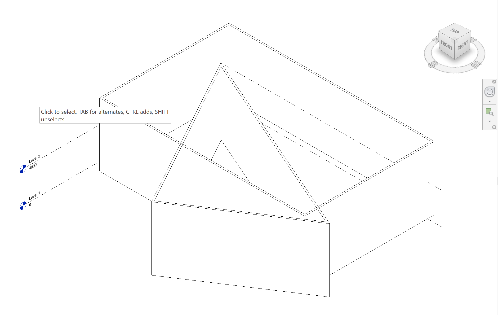

# Usage
```csharp
var customExport = new CustomExporter(
    uiApplication.ActiveUIDocument.Document,
    new BimExport(uiApplication.ActiveUIDocument.Document, @"path\to\sample.bim"));


customExport.IncludeGeometricObjects = false;
customExport.Export(uiApplication.ActiveUIDocument.ActiveView);
```

# Sample


